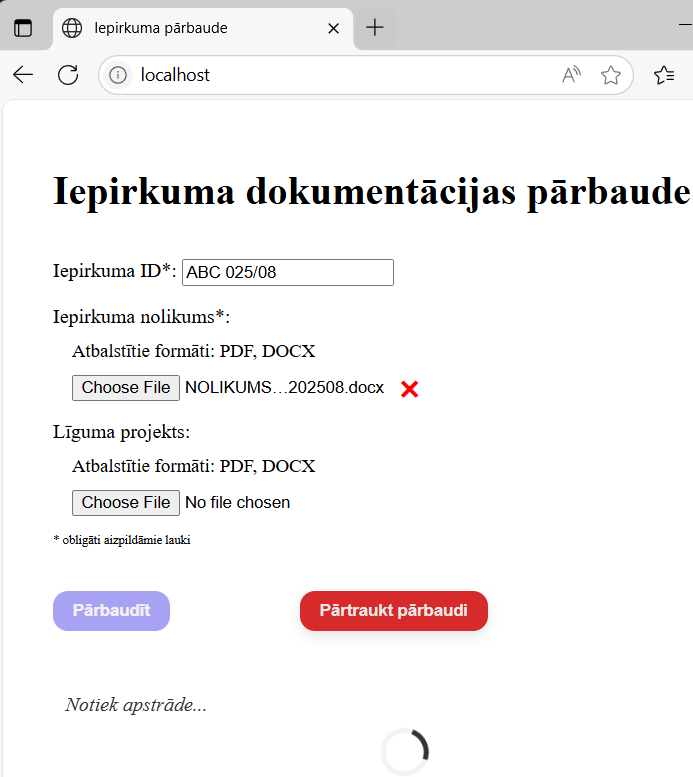

# Prototips (demo)

Šī mape satur visus datus, kas nepieciešami prototipam. To iespējams darbināt kā izstrādes vai produkcijas vidi.
Visām vidēm nepieciešams Docker (https://www.docker.com/), lai tās darbinātu. 
Skripti un dati, ko prototips izmanto, ir nedaudz modificēti salīdzinājumā ar testa vidē (galvenā mape) izmantotajiem skriptiem.
Pievienojot jaunus jautājumus testa vidē, jāatceras tos pielikt arī prototipam, ja ir vēlme pārbaudīt tos arī prototipā.

## Uzstādīšana
Failā *.env-example* jāievada mainīgie, kas nepieciešami pieejai LLM modelim un DockerHub vietnei, un jāmaina faila paplašinājums uz *.env*.

### LLM modelis
Atbilžu ģenerēšanai tiek izmantots Azure OpenAI *gpt-4o* modelis. Lai iegūtu pieeju šim modelim, [portal.azure.com](https://portal.azure.com/) ir jāizveido Azure OpenAI resurss. Pēc tam [Azure OpenAI Studio](https://oai.azure.com/) jāizvēlas *Deployments* un jāizvēlas modelis 'gpt-4o'. Vērtībai *Deployment name* jābūt tādai pašai kā *Model name* - 'gpt-4o'.
 
Skatīt vairāk [šeit](https://learn.microsoft.com/en-us/azure/cognitive-services/openai/overview)
 
.env failā jāieraksta modelim atbilstošas vērtības - AZURE_OPENAI_KEY, AZURE_ENDPOINT un AZURE_OPENAI_VERSION.

### 1. Produkcijas vide
Lai darbotos produkcijas vidē, komandrindā jāievada šāda komanda (Papildus var norādīt --TAG lai norādītu specifisku versiju):
```
./deploy_prod.sh
```

Šī komanda lejupielādēs Docker attēlus, kas satur projektu, un to iedarbinās. Pēc komandas izpildes ar prototipu var darboties tīmekļa pārlūkprogrammā adresē **http://localhost:80**. To var arī tālāk izmitināt zem kādas citas IP adreses.



### 2. Izstrādes vide
Šī vide ir paredzēta, lai veiktu turpmāku prototipa izstrādi un testēšanu, kā arī ja tiek mainīta testējamo jautājumu kopu. Mainot kodu un to saglabājot, nav jāapstādina konteineris, tas uzreiz būs pieejams, ja vien netiek mainītas jau ielādētās bibliotēkas.

- Lai darbinātu projektu pirmo reizi, vispirms ir jāsabūvē docker konteineris. Ierakstot terminālī šādu komandu, konteineris tiek sabūvēts un startēts:
```
docker compose up --build
```
- Pārējās reizies atkārtoti pārbūvēt projektu nav nepieciešams, to var startēt ar šādu komandu:
```
docker compose up
```
- Konteineri var apstādināt ar šādu komandu:
```
docker compose down
```

#### Produkcijas vides atjaunošana:

Pēc izstrādes pabeigšanas produkcijas konteineri var sabūvēt un augšupielādēt DockerHub vietnē zem DOCKERHUB_USERNAME lietotāja ar šadu komandu:

```
./build_and_push.sh
```
(Papildus var norādīt --TAG lai norādītu specifisku versiju)

Pēc pārbūvētas konteinera versijas saglabāšanas DockerHub vietnē, to atkal ir iespējams lietot produkcijā.